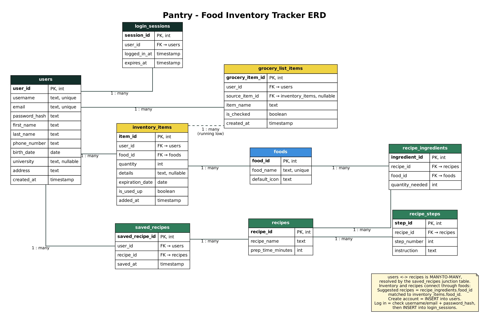

Section 1 Group 1 README Document

1. App Summary

College students with access to a kitchen, groceries, and cooking for themselves need a single website platform that can account for their purchased food as they grocery shop and help them use their food in a timely manner by suggesting recipes based on what they already have. Whether living alone or with roommates, students often buy and manage their own food individually, making it difficult to buy the right amount, avoid over-buying, and use ingredients before they expire. Tracking expiration dates and finding efficient ways to use food before it goes bad, while also remaining budget-conscious with limited free time for meal planning, can be difficult. We see this platform aiding individual students in eliminating food waste, building more conscious grocery habits, and managing expiration dates efficiently. As a future direction, we see this platform growing to let roommates compare or share grocery inventory. This website lets students log groceries as they shop by entering items, tracks each item’s expiration date, and sends reminders before food goes bad. It then suggests recipes built from the ingredients they already have.

2. ERD
 

3. Tech Stack:

As a team, we decided to use a backend as a service, specifically Supabase. This fits our team because we felt the most comfortable being able to maintain some of the control in building at least part our website. 

4. How to Get it Running

Pantry is a static website (HTML, CSS, and JavaScript) that talks to a hosted Supabase database. There is nothing to install and no server to start: the database is already running in the cloud, and the page connects to it when it loads.

To Open the App (live): 

1. Go to https://lukepchristensen13.github.io/Claude-Digital-Mockup/
2. The app loads in your browser and connects to our Supabase database automatically.

To Run it From a Fresh Copy of Code: 

1. Clone the repository:
   git clone https://github.com/lukepchristensen13/Claude-Digital-Mockup.git
   cd Claude-Digital-Mockup
2. Start a simple local web server from that folder:
   python3 -m http.server 8000
3. Open http://localhost:8000 in your browser.
4. The page connects to the same Supabase database as the live app, so you will see the same data.

For the Database: 

- The database is hosted on Supabase, so there is no local database to set up.
- The tables match the ERD above, and each has a few rows of sample data already loaded.
- The secret service_role key and the database password are not in this repository.

5.
Our working action is the Add Item button, which saves a new food item to the user's inventory.

Open the app and go to the [TODO: screen name, e.g. Inventory] screen.
Fill in the item details: [TODO: list the fields on your form, e.g. food name, quantity, and expiration date]. For example, enter "Milk", quantity 1, and a date next week.
Click Add Item.
Confirm the change appears in the UI: the new item shows up in the inventory list without reloading the page.
Refresh the page (Ctrl+R on Windows, Cmd+R on Mac).
Confirm the item is still in the list.

Note that: 
-clicking Add Item sends a request to Supabase, which inserts a new row into the inventory_items table. 
-Supabase returns the saved row, and the page displays it. 
-Because the item is stored in the database and not just on the page, it is still there after a refresh.
-To double-check in the database, open the Supabase dashboard, go to Table Editor, select inventory_items, and look for the new row.
